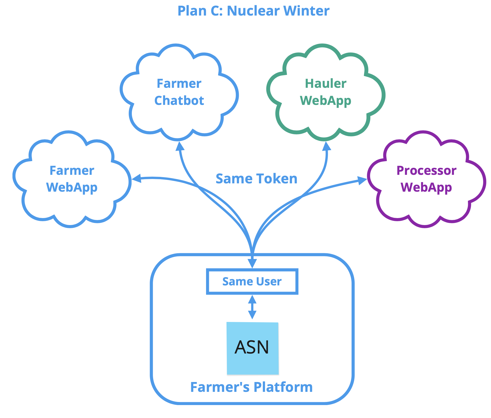
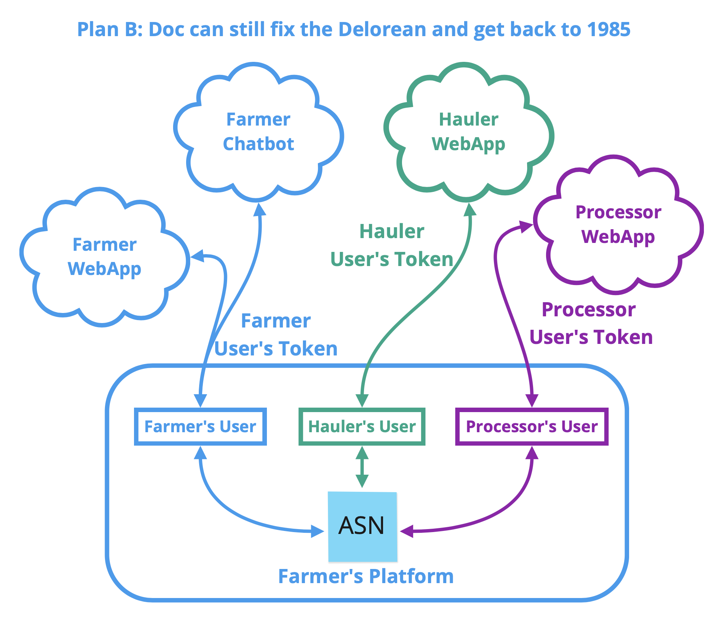
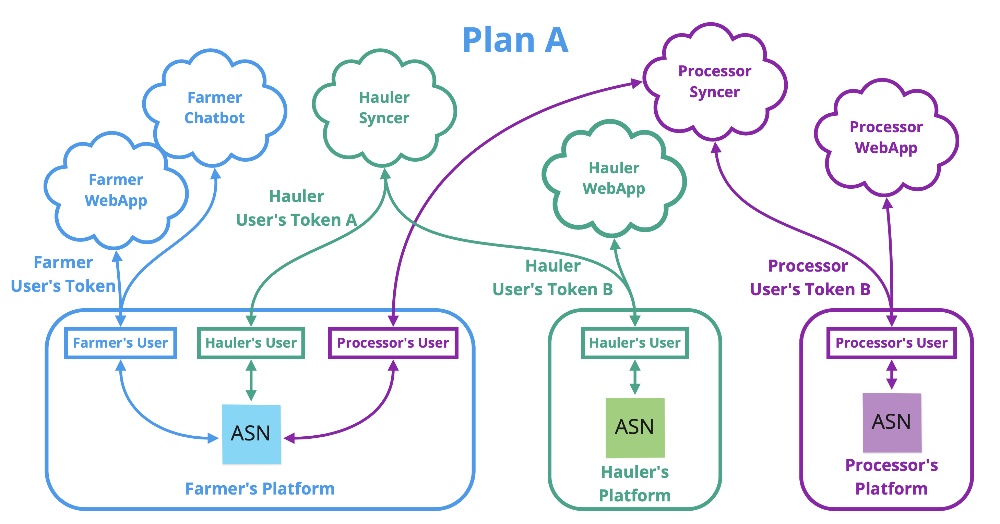
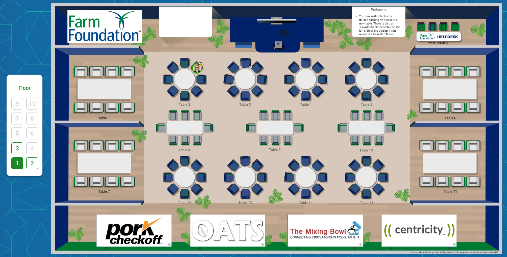

# The Great 2021 Pork Hackathon Series - Part 1: Shipping
---------------------------------------------------------

1. [Overview](#overview)  
1. [Hackathon](#hackathon-final-demo)
    1. [Teams](#teams)
    2. [Contingency Planning](#contingency-planning)
    3. [Hackathon Setup and Logistics](#hackathon-setup-and-logistics)  
1. [Introduction to OADA and Trellis](#introduction-to-oada-and-trellis)
    1. [Installation and Setup](#installation-and-setup)
    2. [Using the ASN API](#using-the-asn-api)
    3. [Get /bookmarks](#get-bookmarks)
    5. [Setup the Advance Ship Notice Base API](#setup-the-advance-ship-notice-base-api)
    6. [Create an ASN](#create-an-asn)
    7. [Change Trees and Versioned Links](#change-trees-and-versioned-links)
    8. [Watching for Changes](#watching-for-changes)
1. [What We Are Really Making](#what-we-are-really-making)


# Overview
--------------
The goal of this hackathon series is to improve interoperabilty among systems in the pork industry.  Part 1: Shipping is targeted at creating a communication channel to streamline communication during pig shipping.  The history and motivation of how we reached this point is beyond the scope of this document.  This document is targeted primarily at technical background and specs for the hackathon itself.

We are creating a standard, open source "integration" layer between systems.  In other words, the farmer has their own private data platform, the trucking company (hauler) can have their own private data platform, and the processor can have their own private data platform, and the apps and other software that serve each.  

>**Creating, demonstrating, and publishing the API by which these systems communicate is the main technical goal of the hackathon.**


The [OATS Center at Purdue](https://oatscenter.org) has developed a framework for building these integration layers.  It goes by two names: the [Open Ag Data Alliance (OADA)](https://github.com/oada/oada-docs) and the [Trellis Framework](https://github.com/trellisfw).  OADA has become the name of the underlying tech stack and Trellis has come to represent the tooling, services, and apps built on top of OADA for connecting data across platform boundaries.  

>**This hackathon will assume that the farmer, hauler, and processor each have their own data platform, and those platforms are all OADA-conformant.**

Because it is open source and easily installable, anyone, including any participant company in the hackathon, can offer an OADA-conformant platform as a service for their customers.

# Hackathon Final Demo
------------------
The hackathon will end with a demo of as many end-to-end features as we can pack into the 3 days.  Brainstorming and open innovation is strongly encouraged, however to provide some structure upon which to build, a base storyline for the target demo is:

Step | Nickname | Actors | Description
-----|----------|--------|------------
1 | Schedule | Farmer | **Farmer** contacts processor to schedule shipment.
2 | Create ASN | Processor | **Processor**'s app creates an Advance Ship Notice (ASN) JSON document that ends up at farmer's platform.
3 | Add Parties | &lt;Any&gt; | **Farmer** or **Processor** adds **Hauler** to ASN once identified and booked, hauler's platform receives ASN.
4 | PQA/TQA | Farmer, Hauler | **Farmer** and **Hauler** add proof of Pork Quality Assurance (PQA) and Transport Quality Assurance (TQA) certification.
5 | More Certs | &lt;Any&gt; | Any additional info identified by hackathon participants can also be added to ASN from any integrated software platforms.
6 | Ship Pigs | Farmer | When it's time to ship, the **Farmer** loads pigs on a truck. 
6a | Chatbot - Ship | Farmer | **Farmer** can text a chatbot provided by a hackathon partner to indicate load has left and # head.
6b | WebApp - Ship | Farmer | **Farmer** can use web app to indicate load has left and # head.
7 | EnRoute | Hauler | **Hauler** uses mobile web app to update location mid-route, **Farmer** and **Processor** can monitor.
8 | Arrival | Hauler | **Hauler** uses mobile web app to indicate arrival in ASN.
9 | Receive Pigs | Processor | Pigs are unloaded from truck and counted.  **Processor** uses mobile app to record received head count in ASN.
10 | Arrival - Notify | Farmer | As a result of processor's write to the ASN, the **Farmer** is notified (via txt chatbot, email, or within mobile web app) of arrival and matching/non-matching head count.
11 | Grade Sheet | Processor, Farmer | After slaughter, **Processor** adds JSON version of kill sheet for the load (or collection of loads) to the ASN and **Farmer** receives.

## Teams
------------------
Participants can decide which teams should form in order to achieve the shared goal. As a suggestion, the outline above seems to have 5 types of teams based on tech stack/skill set:

1: **Web Apps Team** (can have separate "farmer", "processor" and "trucker" teams if enough people)
This team would create in-browser, open source web app(s), hostable via Github pages, to enable interaction with the ASN for the farmer, trucker, and processor.

2: **Chatbot Team**
This team would focus on the text-message-based experience for the farmer to simplify day-of shipping activities.

3: **Certifications Team**
This team will focus on constructing appropriate means to privde PQA,TQA certifications and any other certifications that are available, ideally via OATS AGAPECert automated certifications framework.

4: **Sharing and Sync Team**
This team will build the microservice(s) that perform the 2-way sync between the farmer's platform, the hauler's platform, and the processor's platform.

5: **Integrations Team**
This team will focus on integrating any of this process with existing apps or services.  For example, if a company's existing UI can already make use of some form of shipping records, they could create a microservice to keep their internal api/database in sync with their customer's list of ASN's and then get a great chance to show their platform's features.

## Contingency Planning
------------------------------
In order to maximize team independence and modularity, it is critical that the Sharing and Sync Team's work not hinder any of the other teams' work.  Trellis has a convenient means of achieving this which allows us to have a Plan A (everything works as planned) and a Plan B (some things don't work) and Plan C (only one thing works).  In essence, all apps and services (except the sharing service) will see the same API regardless of which platform and which user they are operating as.  This will manifest itself as follows:


Plan C is the simplest of all the plans.  Just write any app/service using the standardized ASN API and have them all use the same user/token.  If the sharing team isn't done yet, or they don't get done, this works regardless because everybody is editing the same resource(s) as the same user.


Plan B adds an indexer so that only a subset of the Farmer's ASN's are shared with separate users on his/her platform.  The Hauler and the Processor will have a user on the farmer's platform, and the farmer's internal indexer will handle only sharing ASN's with the hauler and processor that they should be allowed to see.  The sharing is done as an internal link, meaning that all the users are editing the same underlying resource, but the farmer can now have ASN's for different haulers and processors that remain private.

From a coding perspective, this just means the apps from Plan C need to use different tokens, but they still work the same.


Plan A is the primary goal.  The hauler and processor will run their own 2-way sync services that will maintain consistency between the ASN copies on all the respective platforms.  The Hauler's app(s) will interact only with the ASN copy on the hauler's platform, the Processor's app(s) will interact only with the ASN copy on the processor's platform, and the farmer's app(s) will interact only with the copy on the farmer's platform.  

The Hauler will have a user on the farmer's platform and a user on their own platform (and similarly for the processor).  The 2-way syncer will use a separate token for each in order to keep both copies of the ASN in sync.

From a coding perspective for all the other teams, this just means the apps from Plan B will need to change the domain they use.


## Hackathon Setup and Logistics
------------------
Each hackathon team will be provided with a virtual machine running Linux within our OpenStack cluster at Purdue.  Each team will receive a private key to use to ssh to it as needed.  That machine will have `oada` pre-installed for 3 domains: the farmer's data platform, the trucking company's platform, and the processor's platform.  For simplicity during the hackathon, we'll serve all three domains from the same machine for a given team, but they are for all intents and purposes separate platforms.

OATS students and staff will be available throughout the hackathon to answer questions and help with understanding any OATS-provided tools, libraries, or services.

The hackathon will take place in the virtual events platform [Remo.co](https://remo.co).  The main "virtual floor" is a set of tables that participants can move freely between as they have discussions.  We intend that each team will have a dedicated table, and any participants can move between teams to collaborate or ask questions.  It is also easy to have ad-hoc small discussions by just having a few people pop over to an unoccupied table.  The "virtual floor" for this hackathon will look like this:



**Each team will elect a "speaker" who will be in charge of making a "pitch" presentation and reporting out during the hackathon on the team's activities and progress.**  The organizers will be coming around to the tables to help identify areas of needed collaboration between teams, and to create 5-minute summaries of progress that the organizers will present live back at OATSCON21 throughout the event.

# Introduction to OADA and Trellis
---------------------------------
OADA is an API specification focused on data synchronization between platforms.  Any platform can be "OADA-conformant" if they implement that API specification alongside their existing API.  Any party in the pork supply chain can provide an OADA-conformant platform for any other party if needed.  OADA provides a reference implementation of that API spec which you can install and run (requires Docker) at (https://github.com/oada/oada-srvc-docker).  It is possible to build an OADA "facade" over top of an existing API in order to make it OADA-conformant.  However, since OADA is designed to facilitate caching and synchronization, and digital storage is very cheap, it is usually simplest to achieve OADA conformance by just installing the reference implementation and writing a single service to keep a cache of your internal data in sync with your OADA deployment's cache.  

OADA does not tell you what data formats you need to use, it only requires that you identify them as the `content-type` on your resources.  This means that in order to have an OADA-conformant API for any application in any industry, you only need to come up with a set of schemas for your data and you get an API spec for free.  OADA standardizes things like:
* Authorization
* Permissions
* Finding the data your app needs
* Reading/writing
* Tracking and subscribing to change notifications

Rather than provide an exhaustive narrative around learning all the features of OADA, we will instead just dive in tutorial-style to the basic setup for this hackathon.

## Installation and Setup
----------------------------
If you want to run `oada` locally for development, you need `docker`, `docker-compose`, and a non-Windows OS (Mac or Linux) w/ `bash`.  Then do this:
```bash
# Get the deployment script
mkdir oada && cd oada
curl -OfsSL https://raw.githubusercontent.com/oada/oadadeploy/master/oadadeploy && chmod u+x oadadeploy
# Install oada using defaults
oadadeploy init -y
source .oadadeploy/bash-completion
# Tell oada to serve localhost
oadadeploy domain add -y localhost
```
You can also deploy the same way in a cloud VM, however you'll need to use your own domain instead of `localhost` in the last command.

Now in order to make requests against `oada`, you'll need a token, and to get a token you'll need a user:
```bash
# Add username bob on domain localhost as an admin (who can make other users)
oadadeploy admin user add -u bob -p testpass1 -d localhost -a
# Create a token w/ scope "all:all" (i.e. that can do anything bob can do)
oadadeploy admin token create -u bob -s all:all
```

Armed with your new token, you are ready to start making REST requests against OADA with a REST client like [Insomnia](https://insomnia.rest/).

## Using the ASN API
--------------------------------

### GET /bookmarks
------------------
In OADA, URL's act sort of like a filesystem of resources rooted at path `/bookmarks`.  Each user has their own bookmarks, and the token you pass determines which user your request is referencing.  Send a different user's token and you'll get a different `/bookmarks` resource.

After install, your bookmarks is "empty":
```http
GET /bookmarks
Host: localhost
Authorization: Bearer <token>
```
Response:
```json
{
  "_id": "resources/default:resources_bookmarks_321",
  "_rev": 1,
  "_type": "application/vnd.oada.bookmarks.1+json",
  "_meta": {
    "_id": "resources/default:resources_bookmarks_321/_meta",
    "_rev": 1
  }
}
```
That tells you the bookmarks resource is JSON, it is of `content-type` `application/vnd.oada.bookmarks.1+json`, and it has a `_meta` document (i.e. another JSON document storing arbitrary data _about_ the resource).  The resource at `/bookmarks` has a "canonical" id of `resources/default:resources_bookmarks_321`.  Also, it is currently on its first revision `_rev: 1`.

### Setup the Advance Ship Notice base API
------------------------------------------
**Please note that this API is not set in stone and may not be the final API from the hackathon.**

We will provide a script to initialize your installation to support the proposed ASN API at the start of the hackathon.  However, for the purposes of helping understand how the API works, we will build it by hand in this section.  

This basically means we are creating the "tree" of resources that would map to the URL `/bookmarks/trellisfw/asns`.  i.e. `/bookmarks` will be a resource with a `trellisfw` key, and `/bookmarks/trellisfw` will be a resource with an `asns` key.

We'll start at the bottom: let's make a resource to hold the ASN's (note the `Content-Type` we're using):

```http
POST /resources
Host: localhost
Content-Type: "application/vnd.trellisfw.asns.1+json"
Authorization: Bearer <token>

{}
```
Response (headers only, no body):
```http
Status: 200 Ok
Content-Location: "/resources/1pnl9KMIw9Dbt9WgC5XHWQIikrE"
```

We now have an empty resource with `_id` `resources/1pnl9KMIw9Dbt9WgC5XHWQIikrE` (i.e. the content-location with the leading `/` removed).  For those who are interested, the part after `resources/` is a K-Sortable Universally Unique Id [`ksuid`](https://github.com/segmentio/ksuid).  It's an extremely handy way of generating random id's: the first half of it is the current timestamp, and the second half is a random string that ensures uniqueness.  If you have a list of ksuids, you can sort them lexically which will sort them by creation time.  Any time a random string is generated in OADA (i.e. on a POST), it is a `ksuid`.

Next, we need to make a resource for the `trellisfw` part of the `/bookmarks/trellisfw/asns` URL, and the body of that will contain an `asns` key which links to our new resource.  **A `link` in OADA is just an object with an `_id` key**.  
```http
POST /resources
Host: localhost
Content-Type: "application/vnd.trellisfw.1+json"
Authorization: Bearer <token>

{
  "asns": { "_id": "resources/1pnl9KMIw9Dbt9WgC5XHWQIikrE" }
}
```
Response (headers only, no body):
```http
Status: 200 Ok
Content-Location: "/resources/1pnoUVMJ7nsQpdmb91CcIG781sv"
```

Now, we have a resource containing an `asns` key which links to our `asns` resource.  This means that you can append the key to the end of a URL that ends at this resource, and OADA will take you to the linked resource.  i.e. `/resources/1pnoUVMJ7nsQpdmb91CcIG781sv/asns` will go to the first resource we created.  **You can append any keys in a resource to the URL (nested keys joined with `/`) and get the value at that key.**

Finally, let's link the trellisfw resource into bookmarks to complete the setup.  We're going to switch from POST to PUT. **All writes to OADA deep merge the "body" of the request into the existing resource,** and increment the `_rev` on the resource.  In fact, a POST is actually just a PUT that appends a `ksuid` on the end of the URL.
```http
PUT /bookmarks
Host: localhost
Content-Type: "application/vnd.oada.bookmarks.1+json"
Authorization: Bearer <token>

{
  "trellisfw": { "_id": "resources/1pnoUVMJ7nsQpdmb91CcIG781sv" }
}
```

That's it!  Now we have an API for ASN's all set and ready to roll, and we know how to read, write, and link together resources.  If you do a `GET /bookmarks/trellisfw/asns`, now you'll get the empty resource that will hold the ASN's.

### Create an ASN
-----------------

For this tutorial, we'll assume an ASN looks like this for simplicity (obviously the real ASN's will have all kinds of other information):
```json
{
  "shipdate": "2021-03-15"
}
```

We would like to POST this ASN to our `/bookmarks/trellisfw/asns` list.  However, if we put all our ASN's into this same resource, over time it is going to become very large.  Therefore, we often choose a _canonical indexing_ structure to group things in a list.  Additional indexes can be created, but the canonical one is assured to be the place you always write the initial link.

The natural indexing for ASN's is by ship date.  Therefore, let's create a `day-index` bucket to put this ASN into.  Our final URL where we will POST this ASN will be: `/bookmark/trellisfw/asns/day-index/2021-03-15`.  We'll need to create this resource which means we need to know a content type with which to create the resource.  By convention, the content-type of any index resource is the same as the original list (`application/vnd.trellisfw.asns.1+json`).  This is because an index is also a list, just a subset of the original list.  

You can create this by hand, or we have a convenient Javascript library that can simplify this. Executing the calls to build API trees like this has a tricky concurrency gotcha: this is handled in the `@oada/client` library.  Not to mention, it can be tedious to do this for large trees.

To use the `tree put` of `@oada/client`, let's first create a JSON tree that holds the structure and `content-types` for our API.  Every level that is supposed to be its own resource needs to have the `_type` specified:
```javascript
const tree = {
  bookmarks: {
    _type: "application/vnd.oada.bookmarks.1+json",
    trellisfw: {
      _type: "application/vnd.trellisfw.1+json",
      asns: {
        _type: "application/vnd.trellisfw.asns.1+json",
        'day-index': {
          '*': {
            _type: "application/vnd.trellisfw.asns.1+json",
            _rev: 0,
            '*': {
              _type: "application/vnd.trellisfw.asn.porkhack.1+json",
              _rev: 0
} } } } } } };
```
Note that every level is its own resource (i.e. has an `_type`) except `day-index`.  This means that when you GET `/bookmarks/trellisfw/asns`, the response will include every day that you have an ASN with a `shipdate` of that day.  Also, the `'*'` means that it will use the same types for each day.  The bottom level is the actual ASN's, for those we'll use `_type` `application/vnd.trellisfw.asn.porkhack.1+json`.  We'll get into why the `_rev: 0` is in there when we discuss live streaming change feeds below.  For now, just make sure it's there.

Now, you'll want to `npm install @oada/client` and we can go ahead and POST our dummy ASN all in one go and it will ensure the path exists (assuming you have your domain, token, and that tree in variables):
```javascript
import { connect } from '@oada/client'

(async () => {
  const oada = await connect({domain,token});
  const { headers } = await oada.post({ 
    path: "/bookmarks/trellisfw/asns/day-index/2021-03-15",
    data: { shipdate: "2021-03-15" }, // This is the ASN
    tree
  });
  console.log(`Created new ASN with _id ${headers['content-location'].slice(1)}`);
  await oada.disconnect();
})()
```

And voila!  Now you have an ASN in your list, feel free to go look around your new API tree and see the ASN.

### Changes
---------------------------

The real power of Trellis comes in its ability to stream an ordered change feed from an arbitrary sub-tree of resources to any destination you want.  If you have a microservice or app, just set a watch on a resource via websockets.  If you want to trigger an external REST service or serverless functions, simply set a webhook on a resource and it will call your API whenever the resource changes.

To see how this works, first we can just look at what a `change` is.  Let's look at the latest change to our ASN resource:

```http
GET /bookmarks/trellisfw/asns/day-index/2021-03-15/1pp0dS2wxFgnYmcMW68pqLZLRFb/_meta/_changes/2
Host: localhost
Authorization: Bearer <token>
```
Resources
```json
[
  {
    "resource_id": "resources/1pp0dfopoHbTPeVlGj2GSFQpIpT",
    "path": "",
    "body": {
      "shipdate": "2021-03-15",
      "_meta": {
        "modifiedBy": "users/default:users_sam_321",
        "modified": 1615864812.55,
        "_rev": 2
      },
      "_rev": 2
    },
    "type": "merge"
  }
]
```

This rev involved a single change (there is 1 thing in the array), it happened to the `resource_id` listed (our asns resource), that resource_id is at the end of your "watch" point (i.e. where you got `_meta/_changes/2` from), and you can see who modified it and when.  Most importantly, if you strip out all the keys of `body` which start with an underscore `_`, you get the original PUT body:
```json
{
  "shipdate": "2021-03-15"
}
```

If you received this change, you would know that it changed (upserted) the shipdate key on this resource to be the value `2021-03-15`.  We call this an "idempotent merge", because if you applied this same change to the resource over and over, you'd still end up with the same resulting state.  This "idempotent merge" represents the change necessary to transition the resource from `_rev` 1 (its creation) to `_rev` 2 (insert of first data).  If you have a remote copy of this resource at `_rev` 1, just do the same merge to your copy and you get a matching `_rev` 2.

### Change Trees and Versioned Links
------------------------------------
We have a problem: we indexed all our ASN's into `day-index` buckets, but we'd like to just set a `watch` on the whole ASN's list and get the changes streamed to us.  In other words, we know we want all ASN changes, regardless of which ASN they belong to, but in order to do that we'd need to set a separate "watch" on every ASN.

OADA to the rescue.  We want to see a change on just the top-level `/bookmarks/trellisfw/asns` resource that contains the changes of any child ASN resources on down the tree.  Remember those `_rev: 0`'s we had in the tree earlier?  **Adding the `_rev` to the link makes it a _versioned link_**.  OADA fills in the value of the `_rev` as the latest known `_rev` on the linked resource.  Whenver the linked resource changes, it will eventually update the `_rev` on that link.  And here's the magic: since that link's content is actually part of the parent resource, OADA will also update the `_rev` on the parent since it's content changed.  This allows you to batch together child changes and listen for them at any arbitrary node in the tree.  All you need to do is make sure your links are versioned.

Let's see this in action.  Since our links were already versioned when we created our ASN resource, we can just look at the change for the latest `_rev` on the `/bookmarks/trellisfw/asns` resource and we should see the underlying addition of the ASN!

To figure out the "current" rev of the parent, do:
```http
GET /bookmarks/trellisfw/asns/_rev
Host: localhost
Authorization: Bearer <token>
```
Response
```json
7
```
(Note, my latest version is 7, but yours may be different.  Use yours in the subsequent calls)

Now, let's look at the change document for verion 7:
```http
GET /bookmarks/trellisfw/asns/_meta/_changes/7
Host: localhost
Authorization: Bearer <token>
```
Response:
```json
[
  {
    "resource_id": "resources/1pnl9KMIw9Dbt9WgC5XHWQIikrE",
    "path": "",
    "body": {
      "day-index": {
        "2021-03-15": {
          "_rev": 2
        }
      },
      "_meta": {
        "modifiedBy": "system/rev_graph_update",
        "modified": 1615864812.593,
        "_rev": 7
      },
      "_rev": 7
    },
    "type": "merge"
  },
  {
    "resource_id": "resources/1pp0dfzhWGD8fsyiJp1JLiMsfHX",
    "path": "/day-index/2021-03-15",
    "body": {
      "1pp0dS2wxFgnYmcMW68pqLZLRFb": {
        "_rev": 2
      },
      "_meta": {
        "modifiedBy": "system/rev_graph_update",
        "modified": 1615864812.571,
        "_rev": 2
      },
      "_rev": 2
    },
    "type": "merge"
  },
  {
    "resource_id": "resources/1pp0dfopoHbTPeVlGj2GSFQpIpT",
    "path": "/day-index/2021-03-15/1pp0dS2wxFgnYmcMW68pqLZLRFb",
    "body": {
      "shipdate": "2021-03-15",
      "_meta": {
        "modifiedBy": "users/default:users_sam_321",
        "modified": 1615864812.55,
        "_rev": 2
      },
      "_rev": 2
    },
    "type": "merge"
  }
]
```
Whoa, that's a lot.  Notice first that there are 3 items in the array: i.e. the move from `_rev` 6 to `_rev` 7 for this resource involved 3 separate underlying changes.  The "leaf" change (i.e. the original change down at the leaf node which is our newly-added ASN) is the last one. Notice it is the same as the one we looked at above, except that the `path` key is different.  In this case, it means "the path to this changed resource from the current 'root' resource is `/day-index/2021-03-15/1pp0dS2wxFgnYmcMW68pqLZLRFb`.  You can see the `shipdate` data in that change.

The next one up is the change to path `/day-index/2021-03-15` which just updated the `_rev` on the versioned link in that day-index resource.  Finally, the top one is the "root" resource that you are "watching" for changes, and it is just an update to the `_rev` of the day-index resource.

This makes it incredibly easy to react to changes of an arbitrarily complex API tree: just watch for changes, filter the change docs to the resources you care about using the paths, and then grab the underlying data that matters to you.

### Watching for Changes
------------------------
Polling for changes like we did above works just fine, but it's not efficient.  You can actually ask OADA to just push you a stream of changes starting from a `_rev` of your choice on any resource you want.  You can ask it to do this via a websocket, or as a webhook.  You can even ask it to replay the change automatically at a remote OADA service as a sort of OADA-aware webhook (i.e. performing a one-way sync).

To see this work, we'll just use your browser's console to open a websocket to your OADA server.  Note that you'll have to figure out how to get your browser to trust your self-signed `localhost` SSL certificate if you want to try this.  If you are using Chrome or Brave, this is harder than it used to be.  Go to either chrome://flags/#allow-insecure-localhost or brave://flags/#allow-insecure-localhost and check the box to allow your browser to accept the localhost cert.  Then, to make sure it works, go to this URL in your browser: https://localhost/.well-known/oada-configuration.  If you see some JSON show up, you're all set.

To open the websocket in your browser console and set the watch, just paste this into your browser console (**Replace &lt;token&gt; with your token**):
```javascript
var w = new WebSocket('wss://localhost');
   w.onopen = function(evt) { console.log('open!!') };
  w.onerror = function(evt) { console.log('ERROR! evt = ', evt); }
w.onmessage = function(evt) { console.log('message! ', JSON.parse(evt.data)) };
w.send(JSON.stringify({
  requestId: '1',
  method: 'watch',
  headers: { authorization: 'Bearer <token>' },
  path: '/bookmarks/trellisfw/asns',
}));
```
Now, go ahead and re-run your javascript code from above to add another new ASN for today's day-index.  You'll see the change appear as it is pushed from your OADA service to your console.

To set a watch in code using `@oada/client`, you can simply do:
```javascript
const oada = await connect({domain, token});
const requestId = await oada.watch({
  path: '/bookmarks/trellisfw/asns',
  rev: 1, // optional, the _rev from which to resume the watch
  watchCallback: d => {
    console.log(d); // This runs on every change
  },
})
```
To unwatch a resource, use the unwatch request with the returned `requestId` above:
```javascript
const response = await oada.unwatch(requestId);
```

That should be enough to get anyone started working with the OADA API for this hackathon.

## What we are really making
----------------------------
Now that you are familiar with OADA, you can understand that using OADA as the underlying API framework means we can publish some **API trees** and set of **content-type schemas** for any data we think is relevant to this hackathon.  This will inherently define all the endpoints, how to discover if your user has them, how to use them, what they mean, how to keep your side up to date with the remote, and how to react to events.
